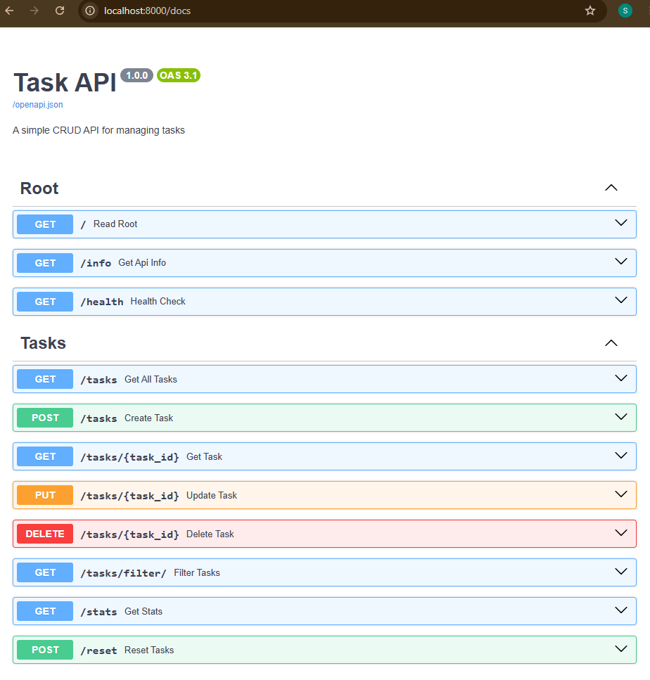

# 📝 Task API - A Simple CRUD Backend

A RESTful API built with **FastAPI** that manages a to-do list with full CRUD (Create, Read, Update, Delete) operations.

This project demonstrates fundamental backend development concepts including request/response handling, validation, error handling, HTTP status codes, RESTful API design, and automatic API documentation.

---

## 🎯 Features

- **Complete CRUD Operations**: Create, Read, Update, and Delete tasks
- **In-Memory Storage**: Data lives in memory and resets when the server restarts
- **Input Validation**: Server-side validation ensures data integrity
- **Proper HTTP Status Codes**: `200`, `201`, `204`, `400`, and `404`
- **Auto-Generated Documentation**: Swagger UI at `/docs` and ReDoc at `/redoc`
- **Health Check**: Health monitoring endpoint
- **Filtering**: Filter tasks by completion status with `?done=true/false`
- **Search**: Search tasks by title with `?search=keyword`
- **Statistics**: View task statistics through `/stats`
- **Reset**: Restore the default tasks through `/reset`

---

## 🛠️ Tech Stack

- **Python 3.10+**
- **FastAPI** - Modern Python web framework
- **Uvicorn** - ASGI server
- **Pydantic** - Data validation

---

## 📦 Installation

### Prerequisites

Make sure you have the following installed:

- Python 3.10 or higher
- Git

### 1. Clone the Repository

```bash
git clone https://github.com/syedriyyan9-cloud/FlyRank/tree/main/Task%201%20(Build%20your%20first%20CRUD%20API)
cd todo-api
```

### 2. Create and Activate a Virtual Environment

#### macOS / Linux

```bash
python -m venv venv
source venv/bin/activate
```

#### Windows

```bash
python -m venv venv
venv\Scripts\activate
```

### 3. Install Dependencies

```bash
pip install -r requirements.txt
```

### 4. Run the Server

```bash
uvicorn main:app --reload
```

The API will be available at:

```text
http://localhost:8000
```

### 5. Access the Documentation

**Swagger UI**

```text
http://localhost:8000/docs
```

**ReDoc**

```text
http://localhost:8000/redoc
```

---

## 🚀 API Endpoints

| Method | Endpoint | Description | Status Codes |
|---|---|---|---|
| `GET` | `/` | Welcome message | `200` |
| `GET` | `/info` | API information and available endpoints | `200` |
| `GET` | `/health` | Health check for monitoring | `200` |
| `GET` | `/tasks` | Get all tasks | `200` |
| `GET` | `/tasks/{id}` | Get a specific task by ID | `200`, `404` |
| `POST` | `/tasks` | Create a new task | `201`, `400` |
| `PUT` | `/tasks/{id}` | Update an existing task | `200`, `400`, `404` |
| `DELETE` | `/tasks/{id}` | Delete a task | `204`, `404` |
| `GET` | `/tasks/filter/` | Filter tasks by status and/or search | `200` |
| `GET` | `/stats` | Get task statistics | `200` |
| `POST` | `/reset` | Reset to default example tasks | `200` |

---

## 📝 Example Usage

### Create a Task

```bash
curl -i -X POST http://localhost:8000/tasks \
  -H "Content-Type: application/json" \
  -d '{"title":"Buy groceries"}'
```

Expected response:

```text
HTTP/1.1 201 Created
content-type: application/json
content-length: 49

{"id":4,"title":"Buy groceries","done":false}
```

### Get All Tasks

```bash
curl -i http://localhost:8000/tasks
```

Expected response:

```text
HTTP/1.1 200 OK
content-type: application/json

[
  {"id":1,"title":"Learn FastAPI","done":false},
  {"id":2,"title":"Build CRUD API","done":false},
  {"id":3,"title":"Write documentation","done":true}
]
```

### Update a Task

```bash
curl -i -X PUT http://localhost:8000/tasks/1 \
  -H "Content-Type: application/json" \
  -d '{"title":"Learn FastAPI properly","done":true}'
```

Expected response:

```text
HTTP/1.1 200 OK
content-type: application/json

{"id":1,"title":"Learn FastAPI properly","done":true}
```

### Delete a Task

```bash
curl -i -X DELETE http://localhost:8000/tasks/1
```

Expected response:

```text
HTTP/1.1 204 No Content
```

### Filter Tasks

Filter completed tasks:

```bash
curl -i "http://localhost:8000/tasks/filter/?done=true"
```

### Search Tasks

```bash
curl -i "http://localhost:8000/tasks/filter/?search=FastAPI"
```

### Get Statistics

```bash
curl -i http://localhost:8000/stats
```

Expected response:

```json
{
  "total": 3,
  "done": 1,
  "open": 2
}
```

### Reset to Default Tasks

```bash
curl -i -X POST http://localhost:8000/reset
```

---

## 📊 Swagger UI Screenshot



The API automatically generates interactive documentation through FastAPI. You can open Swagger UI in your browser and test the available endpoints directly.

---

## 🧪 Testing the Full CRUD Cycle

The following sequence demonstrates a complete Create → Read → Update → Read → Delete → Read workflow.

### 1. Create a Task

```bash
curl -i -X POST http://localhost:8000/tasks \
  -H "Content-Type: application/json" \
  -d '{"title":"Test Task"}'
```

### 2. Get All Tasks

```bash
curl -i http://localhost:8000/tasks
```

### 3. Update the Task

```bash
curl -i -X PUT http://localhost:8000/tasks/4 \
  -H "Content-Type: application/json" \
  -d '{"title":"Updated Test Task","done":true}'
```

### 4. Get the Updated Task

```bash
curl -i http://localhost:8000/tasks/4
```

### 5. Delete the Task

```bash
curl -i -X DELETE http://localhost:8000/tasks/4
```

### 6. Verify Deletion

```bash
curl -i http://localhost:8000/tasks
```

---

## 🔍 Error Handling Examples

### Task Not Found — 404

```bash
curl -i http://localhost:8000/tasks/999
```

Response:

```text
HTTP/1.1 404 Not Found
content-type: application/json

{"detail":"Task 999 not found"}
```

### Invalid Input — Empty Title

```bash
curl -i -X POST http://localhost:8000/tasks \
  -H "Content-Type: application/json" \
  -d '{"title":""}'
```

Response:

```text
HTTP/1.1 400 Bad Request
content-type: application/json

{"detail":"Title cannot be empty"}
```

---

## 💾 Data Persistence Observation

This API uses in-memory storage, so the tasks are stored only while the FastAPI process is running.

When I restarted the server, the tasks I had created or modified were lost and the application returned to the three default tasks because the data is stored in a Python list rather than a persistent database.

---

## 💡 Important Notes

### In-Memory Storage

⚠️ **Important:** This API intentionally uses in-memory storage. All data is stored in a Python list and is reset to the three default tasks every time the server restarts.

This demonstrates why production applications need a persistent database such as PostgreSQL, SQLite, or another database system.

---

## 🤖 AI vs Me

### Full Prompt Used

> Build a simple RESTful CRUD API using FastAPI for a to-do list application. The API should support creating, reading, updating, and deleting tasks. Use in-memory storage, Pydantic models for validation, appropriate HTTP status codes, error handling, and automatic FastAPI documentation. Also include a health check, filtering by completion status, title search, task statistics, and a reset endpoint. Provide a clean project structure and documentation with examples for testing the API using curl.

### Differences I Found During Review

After reviewing and testing the AI-generated implementation, I found several issues and areas that required my own verification and correction:

1. **Formatting and documentation issues**  
   The initial README contained broken Markdown code blocks, missing language specifiers, and an improperly formatted endpoint table. I corrected these so the documentation renders properly on GitHub.

2. **Incorrect Swagger screenshot reference**  
   The original README used a normal URL-like text link for the screenshot. I changed it to a Markdown image reference:
   ``

3. **HTTP response details needed verification**  
   The curl examples did not consistently show complete `curl -i` responses. I added response headers and status lines where appropriate so the examples better represent actual HTTP responses.

4. **In-memory data behavior needed to be tested**  
   Restarting the server demonstrated that newly created or modified tasks disappear. This confirmed that the application is using temporary in-memory storage rather than a persistent database.

5. **API behavior was reviewed instead of blindly accepting generated code**  
   I checked the CRUD flow, status codes, validation behavior, filtering, searching, statistics, and reset functionality to understand what the application was actually doing.

### What I Learned From Using AI

AI can significantly speed up development, but generated code still needs to be reviewed and tested. Understanding HTTP methods, status codes, validation, Python data structures, and FastAPI fundamentals made it possible to identify problems instead of simply assuming that the generated implementation was correct.

---

## 📚 What I Learned Building This

### Backend Fundamentals

I learned more about the request/response cycle, HTTP methods, status codes, and how a backend API communicates with clients.

### CRUD Operations

CRUD operations are the foundation of many backend applications. This project provided practical experience with creating, reading, updating, and deleting resources.

### Validation

Client input should never be trusted blindly. Server-side validation is necessary to maintain data integrity and provide useful error responses.

### API Design

I practiced RESTful API design, resource-oriented endpoints, HTTP methods, and appropriate status codes.

### API Documentation

FastAPI's automatic OpenAPI documentation and Swagger UI make it much easier to inspect and test an API during development.

---

## 🧠 The Lesson

> **AI code is only as good as your specification.**

Being able to review, test, debug, and understand AI-generated code is a critical backend development skill. AI can help accelerate development, but it does not replace understanding the system being built.

---

## 📁 Project Structure

```text
todo-api/
├── main.py                     # Main application code
├── requirements.txt            # Python dependencies
├── README.md                   # Project documentation
├── swagger-screenshot.png      # Swagger UI screenshot
└── venv/                       # Virtual environment (ignored by Git)
```

---

## 🤝 Contributing

This is a learning project. Feel free to fork the repository, experiment with the code, and improve the implementation.

---

## 📚 Resources

- [FastAPI Documentation](https://fastapi.tiangolo.com/)
- [HTTP Status Codes](https://developer.mozilla.org/en-US/docs/Web/HTTP/Reference/Status)
- [REST API Design Best Practices](https://restfulapi.net/)

---

## 📄 License

This project was created for educational purposes as part of a **FlyRank Backend AI Internship**.
